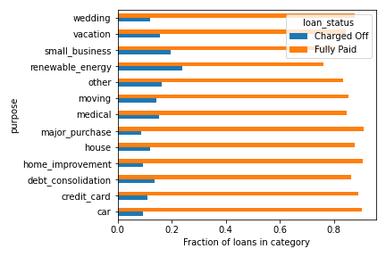

# LendingClub loan default prediction 🏦

## Overview
In this project we wanted to improve the LendingClub risk assessment model. Specifically, we built a model to predict the probability of default, given only the loan characteristics available at time of origination. While challenging to estimate the impact of our model without being able to compare it to the model(s) used by LendingClub, we trained our model using cost-sensitive metrics and believe it can be used as a supplement to the LendingClub's current model. 

In this project we experimented with various preprocessing techniques, feature selection techniques, and methods/metrics for imbalanced data. We used cross-validation to optimize hyperparameters, prevent overfitting, and choose from several models (logistic regression, KNN, XGBoost, neural networks).

### Tags
Probability of default model, finance, machine learning, binary classification, risk assessment, P2P lending, imbalanced data (class weights, re-sampling methods: undersampling, SMOTE), logistic regression, LASSO, K-nearest neighbors, random forests, XGBoost, neural networks, feature selection (embedded, filter, wrapper), EDA

## LendingClub
LendingClub was a peer-to-peer (P2P) lending company that was founded in 2006. The company recorded $16billion in loan originations through 2015, before struggling with governance issues in 2017 and ultimately shutting down at the end of 2020. The platform primarly offered 3-year loans, but eventually expanded to offer 5-year loans with higher interest rates. Average loan amounts for 3-year loans were $10,000. The platform assigned grades to each approved loan based on the borrowers credit history; these grades in turn determined the interest rate. LendingClub made money from borrowers by charging them a 1-5% origination fee, and made money from investors by charging 1% of all amounts paid by the borrower.

## Data and problem definition
The dataset we used can be found on Kaggle (https://www.kaggle.com/wordsforthewise/lending-club). The dataset covers from 3-year and 5-year loans from 2007 to 2018.

Since the only temporal information available on each loan was the most recent payment (i.e we did not have all transaction history) we decided we should only use information available at loan origination and only aim to predict loans that have already completed. 
We thus defined "charged off" as a "bad" loan and "fully paid" as a "good" loan. We aimed to predict whether a loan would be bad or good.

We considered several ways of making a train, validation, test split. We highlighted that in any real business case, we would want to make predictions out-of-time. Thus we used loans originating in 2016Q1 as our test set and all loans originating and ending before 2016Q1 for our training and validation sets.

## Insights
See `EDA.ipynb` for our full analysis. Below we present a few highlights.

The figure above uses the entire dataset, not just the training data. The figure illustrations that several of our predictors (interest rate, credit score, dti) as well as the target (loan status) are non-stationary. This means that out-of-time predictions may be considerably poorer. A surprising pattern is that DTI has contistently increased over time.

The figure above shows the distribution of net profit on all loans in the training data. The median loss on a default loan is $3187, while the median profit on a non-default loan is $1352. Note that default loans make up 12% of the training data while the other 88% are non-default.

Above we look at how loan purpose associates with loan outcome. We see that loans for renewable energy or small businesses are more likely to default -- likely due to the venture being unsuccessful. Indeed, loans for renewable energy are over twice as likely to default compared to the average default rate (12%). On the other hand, loans for major purchases/cars are slightly less likely to default (< 10%).

## Modeling
Our full process is in `Modeling.ipynb`, below we mention a few key points.
We used scikit-learn and imb-learn for our modeling purposes. For most categorical variables (`home_ownership`, `purpose`, `addr_state`, `initial_list_status`) we used one-hot encoding, while for `zip_code` we used target encoding due to its high cardinality. We implemented "filter" feature selection methods based on correlations and statistical tests, but also used "embedded methods" such as LASSO regularization. We used `GridSearchCV` to optimize hyperparameters (including those within our feature selection pipeline), and used log loss as our scoring function. Our reasoning for choosing log loss is that probability calibration is especially important in credit-scoring. If we use ROC-AUC -- another scoring metric that does not depend on the chosen threshold -- then this could be optimized while always predicting probabilities of 51%, 49%. We want to have confidence in our predicted probabilities. After training, we did report other metrics as well (confusion matrix metrics, ROC-AUC, etc.). We also developed a metric called "Expected Misclassification Cost" which is essentially a weighted sum of false positives and false negatives. For our actual models, we expiremented with logistic regression, KNN, random forests, XGBoost, and neural networks. For algorithms with a `class_weight` parameter (logistic regression, random forest) we used this to help the model learn the minority class, while for algorithms without this parameter we used random undersampling.

Below we show the evaluation of our best model on the testing data.

## Challenges & Future work
This project presented many challenges and there is still plenty that could be improved upon/extended. We note that our model performance wasn't as good as we had hoped. We suspect this partly has to do with how we treated the imbalanced data. We think that the class weights did not impact the log loss reported in cross-validation (it only impacts the log loss in the logistic gradient descent) and thus our results were skewed. Regardless, we do not think it would have considerably improved performance. Rather, this is a hard task; note that the "low hanging fruit" had already been rejected by LendingClub and were not present in our data. Future work might pair the LendingClub data with additional economic data, for example by joining the borrower's address state with the median household income for that state. More advanced sampling methods (e.g. SMOTE), more thorough hyperparameter optimization (i.e. through `hypopt` or Bayesian hyperparameter optimization), and more complex models may also lead to better performance. Also, future work might try to use this dataset to predict the "grade" assigned by LendingClub (or bin loans into custom grades) as a multi-class classification task.  